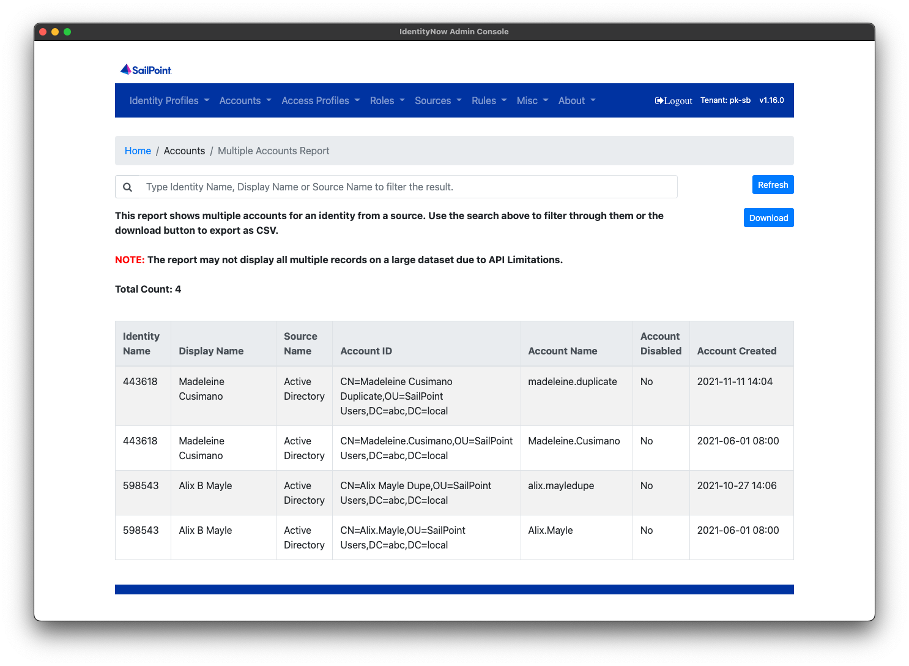
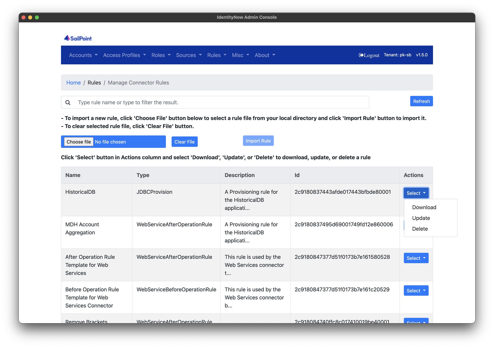

# IDN Admin Console #

> This application is not developed, maintained or supported by SailPoint. It is built and based on a community effort.

This tool is build to help the community to manage SailPoint IdentityNow (IDN).

## Release

You can download the latest Windows/Mac/Linux build from [Release](https://github.com/piyush-khandelwal-sp/idn-admin-console/releases) page

Latest Docker Build can be found at [Docker Hub](http://hub.docker.com/r/khandelwalpiyush/idn-admin-console) page

**NOTE:** Currently the builds are not code-singed. For Mac, please download and unzip, right click and open for the first time. Then you can open normally for subsequent uses.

## Authentication

You require `{tenant}` and PAT ID and Token as mentioned [in this guide](https://developer.sailpoint.com/docs/getting_started.html).

Alternatively if you have an internal domain other than identitynow.com please fill it in the domain name section of login.

**NOTE:** For Vanity URL's please [find your](https://developer.sailpoint.com/docs/getting_started.html#finding-your-org-tenant-name) `{tenant}` as per the article above and use that. **DO NOT** fill in your vanity URL domain in the Domain Name section.

## Contribute

We are looking for (list is not exhaustive)

* Help from community if they are interested in spreading the word
* Help us build more features and extend existing ones.
* GitHub and Actions know-how to help management and auto build / deploy / version et al
* Help us make the Angular framework better and plug holes if any. Upgrade existing versions and remove non used dependencies.
* Help us enhance it (pagination, current build documentation / standardizing and refactoring code et al .. list is endless)
* Testing, finding, and reporting and hopefully help fixing bugs - we are bound to find lot of issues to being with.
* Looking for contributors for the repo to help us set it up properly.

## Features

* Find Multiple Accounts in Source and Download Report
* Identity Profiles
    * Manage Identity Profile (Move Priority / Refresh Individual Profile / Export All)
    * Manage Identity Attribute Index (Index / Unindex Attributes)
    * Manage Transforms (Add / Update / Delete / Download / Export All)
* Access Profiles
    * Manage Access Profiles (Enable / Disable / Delete / Export All)
    * Manage Access Profile Owners
* Roles
    * Manage Roles (Enable / Disable / Mark-Umark as Requestable / Delete / Export All)
    * Manage Role Owners
* Sources
    * Manage Aggregation Schedules (Enable / Disable / Backup and Restore Accounts & Entitlement)
    * Manage Source Owners
    * Run Aggregations (Unoptimized / File Upload)
    * Reset Source (Accounts / Entitlements / Both)
    * Source Info (Internal Name / ID / Count / Export All)
* Rules
    * Manage Cloud Rules (Download)
    * Manage Connector Rules (Add / Update / Delete / Download)
* Misc
    * Check and Set Org Time
    * Manage PAT (See Permission / Delete Token)
    * Org Statistics (Pretty cool to see)

## Screenshots

## Manual Build

The application can be run as a standalone web application, inside docker container or packaged as an electron application (desktop app style). Follow the steps below to get it up and running in your preferred environment.

### Run as Standalone App ###
* Prerequisites
    * Install nodejs 
    * Install Angular CLI
        * npm install -g @angular/cli
    * Run command in root directory:
        * npm install
* Run in local
    * ng serve --open
    * Type URL in browser: http://localhost:4200
* Build Package
    * npm run build-prod

### Run as electron app ###
* Prerequisites
    * sudo su
    * npm install electron-packager -g
    * brew install --cask wine-stable
* Run in local
    * npm run build-prod
* Build electron package for Mac OS
    * npm run build-prod
    * electron-packager . --platform=darwin --overwrite
* Build electron package for Windows
    * npm run build-prod
    * electron-packager . --platform=win32 --overwrite

### Run as container app ###
* Prerequisites
    * Install docker
* Run in local
    * npm run build-prod
    * docker build -t idn-admin-console-image .
    * docker run --name idn-admin-console-container -d -p 8080:80 idn-admin-console-image
    * Type URL in browser:  http://localhost:8080
    * To stop container
        * docker stop idn-admin-console-container
    * To remove container
        * docker rm idn-admin-console-container
    * To delete image
        * docker rmi idn-admin-console-image

## 📝 License

This project is [MIT](https://github.com/piyush-khandelwal-sp/idn-admin-console/blob/main/License) licensed.