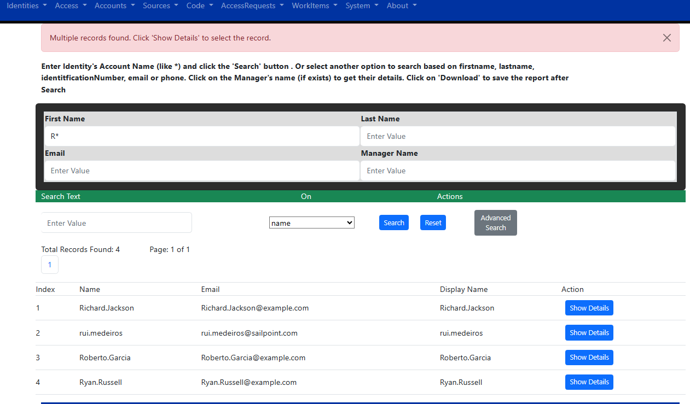
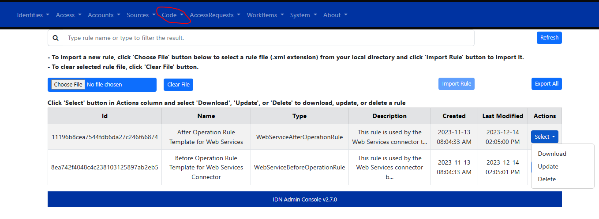

# IDN Admin Console #

> This application is not developed, maintained or supported by SailPoint. It is built and based on a community effort.

This tool is build to help the community to manage SailPoint IdentityNow (IDN).

## Release

You can download the latest build from [Release](https://github.com/piyush-khandelwal-sp/idn-admin-console/releases) page

Currently the builds are not code-singed. For Mac, please download and unzip, right click and open. Then you can open normally for subsequent uses. Warning should go away

## Features
* Find Multiple Accounts in source and download report
* Sources
	* Bulk Manage Aggregation Schedules (enable / disable / backup and restore accounts & entitlement)
	* Bulk Manage Source Owners
	* Bulk Run Aggregations (unoptimized/file upload)
* Rules
	* Download Cloud Rules
	* Manage Connector Rules (Add / update / delete / download)
* Roles
	* Bulk Manage Roles (Enable/disable/mark unmark as requestable/delete)
	* Bulk Manage Source Owners
* Misc
	* Check and Set Org Time

## Screenshots

## Manual Build

The application can be run as a standalone web application, inside docker container or packaged as an electron application (desktop app style). Follow the steps below to get it up and running in your preferred environment.

### Run as Standalone App ###
* Prerequisites
    * Install nodejs 
    * Install Angular CLI
        * npm install -g @angular/cli
    * Run command in root directory:
        * npm install
* Run in local
    * ng serve --open
    * Type URL in browser: http://localhost:4200
* Build Package
    * ng build --prod

### Run as electron app ###
* Prerequisites
    * sudo su
    * npm install electron-packager -g
    * brew install --cask wine-stable
* Run in local
    * npm run build-prod
* Build electron package for Mac OS
    * npm run build-prod
    * electron-packager . --platform=darwin --overwrite
* Build electron package for Windows
    * npm run build-prod
    * electron-packager . --platform=win32 --overwrite

### Run as container app ###
* Prerequisites
    * Install docker
* Run in local
    * ng build --prod
    * docker build -t idn-admin-console-image .
    * docker run --name idn-admin-console-container -d -p 8080:80 idn-admin-console-image
    * Type URL in browser:  http://localhost:8080
    * To stop container
        * docker stop idn-admin-console-container
    * To remove container
        * docker rm idn-admin-console-container
    * To delete image
        * docker rmi idn-admin-console-image

## 📝 License

This project is [MIT](https://github.com/piyush-khandelwal-sp/idn-admin-console/blob/main/License) licensed.
